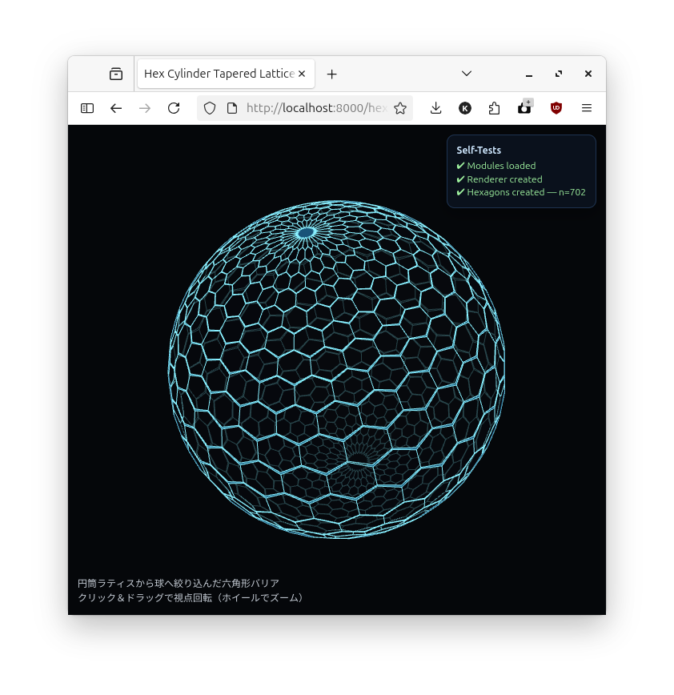

# 六角形タイルによる球形バリアの試作

**これは、六角形のみで球体を敷き詰めるという数学的に不可能な問題に対し、大規模言語モデル（LLM）がどのようなアプローチで「それらしい」解を生成するのかを試す実験的プロジェクトです。**

## スクリーンショット

| 円筒形（テーパー） | 五角形 | 五角形（隙間あり） |
| :---: | :---: | :---: |
|  |  |  |

## デモ

以下のHTMLファイルをブラウザで開くことで、それぞれのバリアのデモを確認できます。

*   [**円筒形バリア（テーパー）** (`hex_sylinder_barrier.html`)](hex_sylinder_barrier.html)
    *   円筒上の正六角形ラティスをベースに、緯度方向に縦寸法と列間隔を逐次補正しながら極へ向けて絞り込むことで、ギャップのない球状シェルを形成しています。
*   [**五角形バリア** (`hex_pent_barrier.html`)](hex_pent_barrier.html)
    *   正二十面体を細分化した測地線ドーム（geodesic dome）の双対メッシュを利用しています。これにより、12個の五角形と多数の六角形が配置され、より均一で歪みの少ない球体メッシュを構築しています。
*   [**五角形バリア（隙間あり）** (`hex_pent_barrier_gapped.html`)](hex_pent_barrier_gapped.html)
    *   上記と同様の測地線ドームをベースにしていますが、五角形のセルを描画せず、六角形セルを縮小して配置することで、セル間に意図的な隙間（ギャップ）を設けています。
